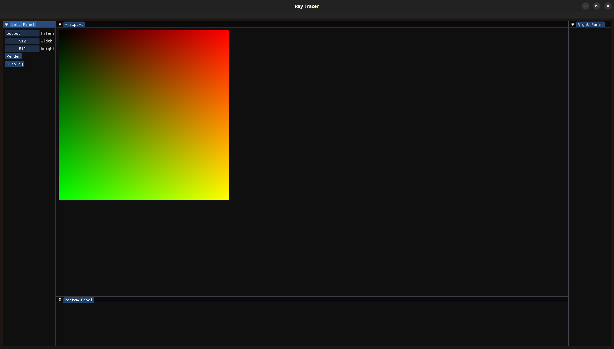

# RayTracer

A minimal ray tracer built in C++ with a custom UI powered by ImGui.  
Supports basic scene rendering, PPM output, and interactive controls.



---

## Installation

### Prerequisites

Make sure you have the following tools installed:

- **CMake** (>= 3.15)
- **g++ / clang++ / MSVC** with C++17 support
- **Git**
- **OpenGL 3.3+ compatible GPU**

All required dependencies (GLFW, GLAD, stb_image, ImGui) are already included in the `external/` folder. No package managers or submodules are needed.

### 🧱 Build Instructions

```bash
# Clone the repository
git clone https://github.com/panagiotisteas/ray-tracer.git
cd ray-tracer

# Create build directory
mkdir build && cd build

# Generate build files
cmake ..

# Build the project
cmake --build .
```

## License

This project is licensed under the MIT License. See the [LICENSE](LICENSE) file for details.